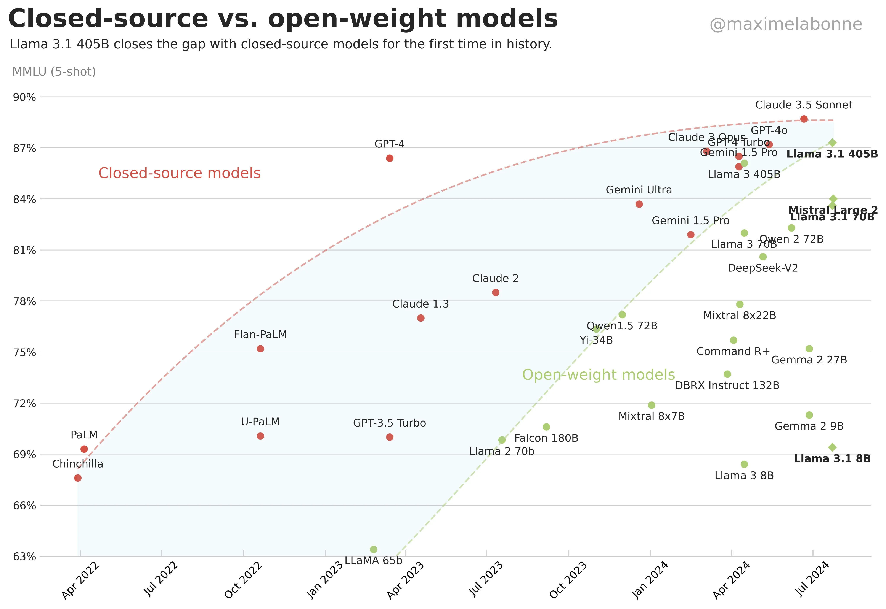
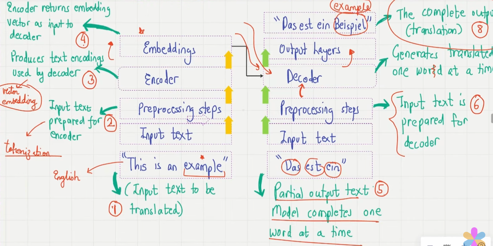

# Week 1
This week, I learnt the basics of an LLM, referring to videos 1 through 6 of [this](https://youtu.be/Xpr8D6LeAtw) YouTube playlist. These are the notes of my learnings.

## Closed-Source vs. Open-Weight Models: A Progression
Open-weight models are those where the parameters used to train the LLM (weights, etc.) are publicly released. Closed-source, as the name suggests, 

Here is an image depicting the progression from April 2022 to July 2024 ([source](https://www.reddit.com/r/LocalLLaMA/comments/1ebrdwa/closedsource_vs_openweight_models_by_maxime/)).

As we can see, closed-source models tend to perform better. However, open-weight models are catching up. An example of an open-weight model is [Llama 3.1](https://ai.meta.com/blog/meta-llama-3-1/) by Meta, and an example of a closed-source model is [ChatGPT](https://chatgpt.com/) by OpenAI.

## What are LLMs?
They are [neural networks](https://en.wikipedia.org/wiki/Neural_network_(machine_learning)) designed to understand, generate and respond to human-like text. The word 'Large' implies that the model is trained on a huge amount of parameters (in the billions/trillions), and the phrase 'Language Model' implies that they perform a wide range of [NLP](https://en.wikipedia.org/wiki/Natural_language_processing) (Natural Language Processing; These models were trained to do very specific language tasks, such as translation.) tasks.

### Advantage of LLMs over NLPs
NLPs were programmed to perform __specific__ tasks such as language translation, and LLMs are capable of performing __various__ NLP tasks as one single model

### Transformers
This is a model first talked about in the paper _[Attention Is All You Need](https://proceedings.neurips.cc/paper_files/paper/2017/file/3f5ee243547dee91fbd053c1c4a845aa-Paper.pdf)_. 

### Clarifying Terminologies
LLM (Large Language Model) $\subseteq$ DL (Deep Learning) $\subseteq$ ML (Machine Learning) $\subseteq$ AI (Artificial Intelligence)

- AI does not always include learning after repetitive prompts; it may also be pre-programmed responses (older chatbots).
- DL only involves neural networks; however ML also involves other learning methods such as [decision trees](https://en.wikipedia.org/wiki/Decision_tree).
- LLM is DL using text only.

Note: Generative AI can be thought of as DL+LLM.

### Applications of LLMs

- Content creation
- Chatbots
- Sentiment analysis
- Language translation
- New (novel) text generation

## Building LLMs

It has two main stages: __Pretraining__ and __Finetuning__.

### Pretraining
It is basically unsupervised training (i.e. on __unlabelled text data__) on a large dataset. Most LLMs publicly available (like ChatGPT) are LLMs which are __only pretrained__. The model numbers are often accompanied by a number stating the number of __tokens__ used for training (e.g. GPT-2 124M).

Pretraining is basically training on word-completion tasks; it has been observed that simply doing this enables chatbots to perform a wide variety of other tasks; this is known as __emergent__ behaviour. Simply pretrained models are also called __foundational__ models.

### Finetuning
A chatbot for a specific company has particular demands and further must be trained separately on a narrower dataset to meet them. This is called finetuning, and is done for companies' specific chatbots for their websites, say. Example: [Harvey](https://www.harvey.ai/), an AI built specifically for attorneys. It is done on a __labelled__ dataset.

### Steps
1. Train on __raw__ text (unlabelled text).
2. Pretraining
3. Finetuning (optional)

## Transformers
It originated from _[Attention Is All You Need](https://proceedings.neurips.cc/paper_files/paper/2017/file/3f5ee243547dee91fbd053c1c4a845aa-Paper.pdf)_.

Here is a simplified version of a transformer: 
Input text $\rightarrow$ Tokenization $\rightarrow$ Encoding $\rightarrow$ Decoding $\rightarrow$ Output

Note: An LLM generates __one__ word at a time.

- Tokenization: Splitting the input text into fragments.
- Encoding: Assigning each token a coordinate in a multidimensional vector space, i.e. __vector embedding__.
- Decoding: The embedded vector is an input to this. 
- The decoder also receives the previously generated output as an input.

### Self-Attention Mechanism
It allows the model to 'weigh importance' of different tokens relative to each other, i.e. capture 'long-range' dependencies. It maintains an 'attention score'.

### Future Transformer Models
1. [BERT](https://en.wikipedia.org/wiki/BERT_(language_model)) (Bidirectional Encoder Representations from Transformers): It predicts hidden words in a sentence (could be anywhere, not necessarily the last word).

2. [GPT](https://en.wikipedia.org/wiki/Generative_pre-trained_transformer) (Generative Pretrained Transformer): It generates a new word at the end of the input sentence.

Note: BERT does especially well in sentiment analysis. Also, a BERT model only has an encoder while a GPT model only has a decoder.

### Transformer v/s LLM
Transformer is a generalized model which can be used for other tasks such as computer vision. ViT (Vision Transformers), infact, yield better results than CNNs.
Also, not all LLMs need to be based on transformers; they can be based on recurrent/convolutional architecture as well.

## Pretraining LLMs

### Zero-shot v/s few-shot learning

Basically __n__-shot learning is providing __n__ examples to the GPT model to get an answer. ChatGPT-4 is a zero-shot learner too, however it is a better few-shot learner.

### Data used for pretraining

The dataset used for pretraining GPT-3's largest scale model has 175 billion tokens, taken from various open databases such as Common Crawl, WebText2 etc. The total training cost of a model like GPT-3 would be __$4.6 million__. This data is __unlabelled__; the tokens themselves act as the labels. 

Pretraining works by generating the __next word__ in a paragraph, using that word as a label (to gauge how close the model's prediction is to said label) and then using the new paragraph as input. This is known as self-supervised learning or self-labelling.

### GPT-3 Pretraining Architecture

GPT models come under the category of __un/self-supervised learning__ (training on unlabelled data). They are trained on next-word generation; the correct word acts as the label itself.

GPT models are __auto-regressive__ models (previous outputs are inputs for future predictions). We take a phrase, make the model predict the next word, feed the new (correct) phrase and repeat this. Hence, we are essentially feeding the output to the input of the same algorithm.

Compared to transformers, GPT doesn't have an encoder block.

The original transformer had 6 encoder-decoder blocks; whereas GPT-3 has 96 transformer layers and 175 billion parameters.

## The Plan 

We would start with assembling data, i.e. tokenization, vector embedding, positional encoding, __batching__ of data (distributing data into batches).

Pretraining and finetuning upon this data are the next steps.